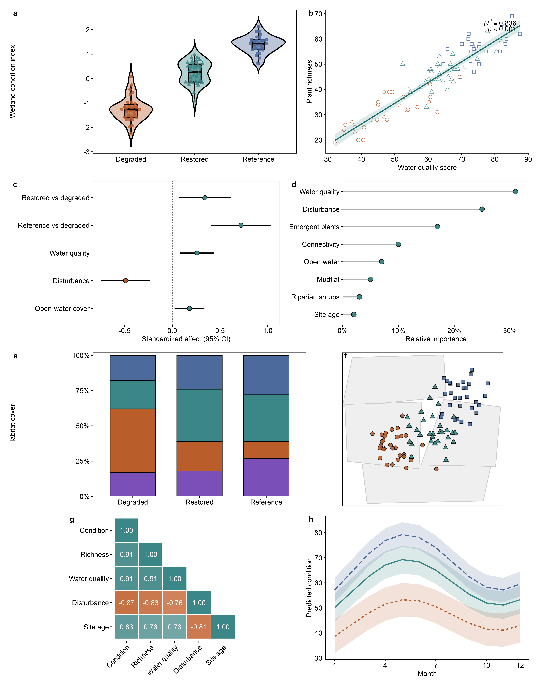

# rfigure.skill



`rfigure.skill` 是一个面向科研论文、学位论文和生态/环境数据分析的 R/ggplot2 作图技能。它不是单个图形模板，而是一套稳定的出版级统计图工作流：先判断图要表达的统计证据，再选择合适的几何对象、标注方式、配色、图例和导出设备。

## 适用场景

- 论文级箱线图、小提琴图、散点回归图、分组比较图和多面板组合图。
- 生态、环境、模型输出、矩阵、地图和显著性标注等科研可视化。
- 需要统一全文章节图形风格、字号、线宽、图例和导出规格的项目。
- 需要检查 ggplot2 图形是否满足正式发表要求的审图流程。

## 核心风格

- 白色背景，四边黑色面板边框，结构线统一为 1 pt。
- 全图默认 Arial 8 pt，面板标签可使用 9-10 pt 加粗作为唯一例外。
- 数据线、拟合线、误差线等应明显重于结构线，避免证据层级不清。
- 使用语义化、克制且可复用的配色，不把装饰效果放在统计信息之上。
- 使用 `ragg::agg_png`、`svglite::svglite` 或合适的字体感知设备导出，避免 Arial 字体丢失。

## 安装

把整个目录放到智能体的 skills 路径即可，例如：

```bash
~/.agents/skills/rfigure.skill
```

如果要让 Claude 或 OpenCode 共用同一份 skill，可以创建符号链接到各自的 skills 目录。这样后续只维护这一份 `SKILL.md`，不同工具会读取同一个版本。

## 使用方式

在需要创建、修改或审查 R/ggplot2 科研图时调用 `rfigure.skill`。它会指导智能体按以下顺序工作：

1. 明确图形承载的统计信息和论文语境。
2. 选择最合适的图形类型，而不是机械套用模板。
3. 统一字体、边框、线宽、图例、标注和导出设备。
4. 对显著性、分组、矩阵、地图和多面板布局做针对性检查。
5. 在交付前验证字体、尺寸、分辨率和图形可读性。

## 示例图

上方示例图展示了一组出版级 R/ggplot2 图形的组合效果，包括箱线图、小提琴图、散点关系、矩阵和多面板布局等典型科研图场景。它用于说明 `rfigure.skill` 的整体视觉目标：干净、稳定、证据优先，并适合直接进入论文图件生产流程。

## 文件结构

```text
rfigure.skill/
├── SKILL.md
├── README.md
├── assets/
│   └── 00_eight_plot_suite_overview.png
└── .gitignore
```

## 发布状态

当前版本已经整理为可提交的 Git 仓库结构。`SKILL.md` 是正式技能主体，`README.md` 为中文简介，`assets/` 保存示例图。本地历史文件和临时备份会被 `.gitignore` 排除，不进入发布版本。
